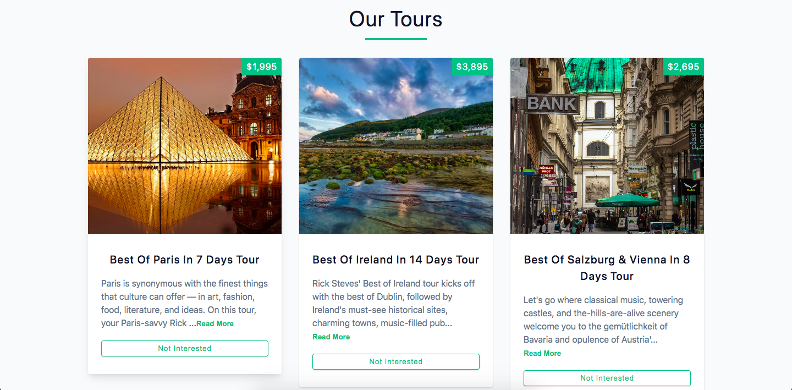

# Our Tours



## Project Description

An Application designed for a tour company with user-friendly `UI` to view and read more information within the description. While also being able to remove any tour that users are not interested in.

In this project, `react.js` was used to created this landing page along with it's functionality. `CSS` was also used for styling.

## Important Links

- https://our-tours-ot.netlify.app/

### Setup Steps

1. [Fork and Clone](https://github.com/iamatos3/Our-Tours) this repository.
2. ```npm install```
3. ```npm run dev```

### Technologies Used

- Vite
- React.js
- HTML
- CSS